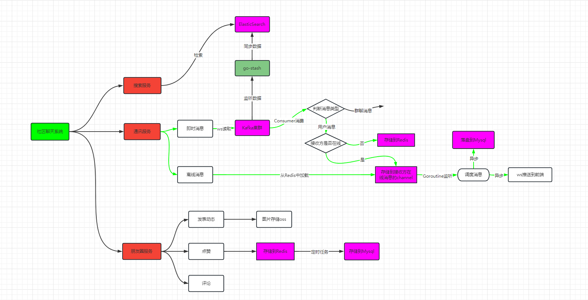

# go-vue-chat
基于 go-zero 实现的聊天系统

# 后端

|        服务器         |                                |
| :-------------------: | ------------------------------ |
| 2核4G 139.198.109.28  | Kafka, Zookeeper, Redis, Mysql |
| 2核4G 139.198.114.118 | go-stash, ES, kibana           |

# 流程图

